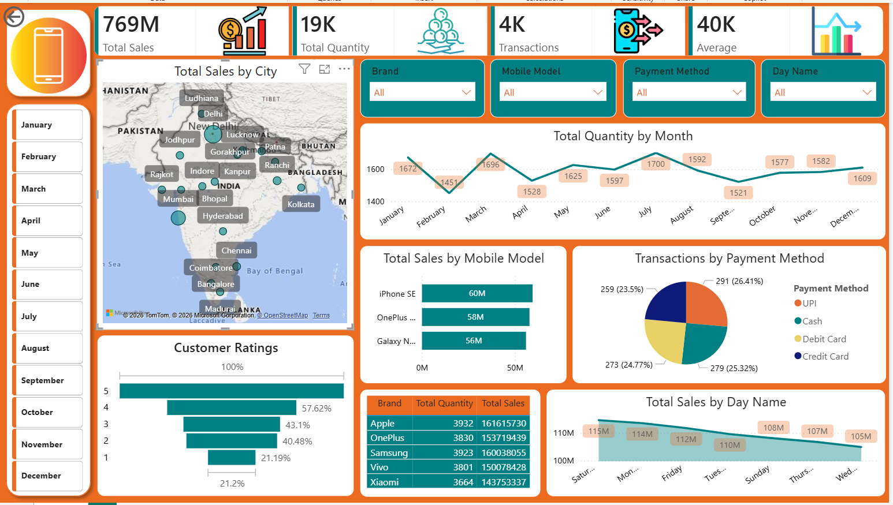

# 📱 Mobile Sales Dashboard – Power BI Project

An interactive Power BI dashboard analysing mobile phone sales across Indian cities, brands, payment methods, customer ratings, and monthly trends.

---

## 📊 Dashboard Preview



---

## 📌 Key Metrics

| Metric | Value |
|---|---|
| 💰 Total Sales | ₹769M |
| 📦 Total Quantity Sold | 19K units |
| 🔄 Total Transactions | 4K |
| 📊 Average Sale Value | ₹40K |

---

## 🔍 Key Insights

- **Apple** leads in total sales at ₹161.6M (3,932 units), followed by **Samsung** at ₹160M and **OnePlus** at ₹153.7M
- **iPhone SE** is the top-selling model at ₹60M, followed by **OnePlus Nord** at ₹58M and **Galaxy Note** at ₹56M
- **UPI** is the most preferred payment method at **26.41%**, followed closely by Credit Card (25.32%), Debit Card (24.77%), and Cash (23.5%)
- **January** recorded the highest quantity sold (1,672 units) and **July** was the second peak month (1,700 units)
- **Saturday** is the highest sales day at ₹115M, with a gradual decline toward **Wednesday** (₹105M)
- **Mumbai** and **Delhi** show the largest sales bubbles on the city map, indicating highest regional contribution
- **100% of customers** gave a rating of 5 stars; ratings of 1–4 show progressively lower response rates (21.2% to 57.62%)

---

## 🗺️ Cities Covered

Ludhiana, Delhi, Jodhpur, Lucknow, Patna, Ranchi, Gorakhpur, Rajkot, Indore, Kanpur, Kolkata, Mumbai, Bhopal, Hyderabad, Chennai, Coimbatore, Bangalore, Madurai and more across India.

---

## 📈 Dashboard Features

- 🗺️ **Sales by City** — Map visualization showing regional sales distribution across India
- 📅 **Monthly Quantity Trend** — Line chart tracking quantity sold across all 12 months
- 📱 **Sales by Mobile Model** — Horizontal bar chart for top performing models
- 💳 **Transactions by Payment Method** — Pie chart showing UPI, Cash, Debit & Credit Card split
- ⭐ **Customer Ratings Analysis** — Bar chart showing rating distribution (1–5 stars)
- 🏷️ **Brand Performance Table** — Total quantity and total sales per brand
- 📆 **Sales by Day of Week** — Area chart showing Saturday as peak sales day
- 🔍 **Interactive Slicers** — Filter by Brand, Mobile Model, Payment Method, Day Name, Month

---

## 🏷️ Brand Performance

| Brand | Total Quantity | Total Sales |
|---|---|---|
| Apple | 3,932 | ₹161,615,730 |
| Samsung | 3,923 | ₹160,038,055 |
| OnePlus | 3,830 | ₹153,719,439 |
| Vivo | 3,801 | ₹150,078,428 |
| Xiaomi | 3,664 | ₹143,753,337 |

---

## 🛠️ Tools & Technologies

| Tool | Purpose |
|---|---|
| Power BI Desktop | Dashboard design and visualisation |
| Microsoft Excel | Data source (.xlsx) |
| DAX | Calculated measures (Total Sales, Avg Sale, Transactions) |
| Power Query | Data cleaning and transformation |
| Map Visual | Geographic sales distribution |

---

## 📁 Project Structure

```
Mobile-Sales-Dashboard/
├── Mobile_Sales_Dashboard.pbix   ← Power BI dashboard file
├── MobileSalesData.xlsx          ← source dataset
├── Dashboard.png                 ← dashboard screenshot
└── README.md
```

---

## 🚀 How to Run

1. Download and install [Power BI Desktop](https://powerbi.microsoft.com/desktop/) (free)
2. Clone this repository
```bash
git clone https://github.com/vanshikaprajapati05/Mobile-Sales-Dashboard.git
```
3. Open `Mobile_Sales_Dashboard.pbix` in Power BI Desktop
4. Explore the dashboard using slicers and filters

---

## 🔮 Future Improvements

- Add YoY (Year-on-Year) growth comparison using DAX time intelligence
- Include profit margin analysis per brand
- Add drill-through pages for city-level deep dive
- Connect to live data source for real-time sales tracking

---

## 👩‍💻 Author

**Vanshika Prajapati** — B.Sc. Computer Science  
[GitHub](https://github.com/vanshikaprajapati05) · [LinkedIn](https://linkedin.com/in/vanshika-prajapati-655b2939b)
